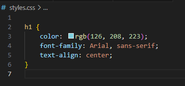

# Retos de HTML5 
Nombre y Apellidos: Kamila Gúrina Gúrina
URL del repositorio de gitlab: git@gitlab.com:kamila_gurina/odaw_2b_kamila_gur.git
Crea un archivo con el nombre retoX.html por cada reto resuelto, deben de estar en la misma carpeta.


## Reto 1: Estructura básica del documento HTML (1 punto) ✅

**Instrucción:**  
Crea un archivo HTML básico que contenga la estructura estándar de un documento HTML5. El documento debe incluir:
- Declaración `<!DOCTYPE html>`
- Elementos principales: `<html>`, `<head>`, `<body>`.
- Agrega una etiqueta `<title>` con el nombre del documento.
- Añade un encabezado `<h1>` con el título "Mi Primer Documento HTML".


- El resultado de Html en la web


## Reto 2: Estructura de una etiqueta HTML (1 punto) ✅

**Instrucción:**  
Crea un archivo HTML que utilice diferentes etiquetas HTML, respetando su estructura correcta. Debes usar:
- Etiqueta de imagen ``.
- Etiqueta de párrafo `<p>`.
- Etiqueta de enlace `<a>`.

Incluye al menos dos atributos en cada etiqueta.


- El resultado de Html en la web


## Reto 3: Atributos comunes en HTML (1 punto) ✅

**Instrucción:**  
Crea un archivo HTML donde se utilicen al menos los siguientes atributos:
- `id`
- `class`
- `style`

Debes aplicarlos a etiquetas como `<div>`, `<p>`, y `<h1>`.


- El resultado de Html en la web


## Reto 4: Etiquetas de cabecera y metadatos (1 punto) ✅

**Instrucción:**  
Crea un archivo HTML donde el `<head>` contenga los siguientes elementos:
- `<meta charset="UTF-8">`
- `<meta name="description" content="Descripción de mi sitio web">`
- `<meta name="author" content="Nombre del autor">`
- `<title>` que describa el propósito de la página.


- El resultado de Html en la web


## Reto 5: Recursos externos (CSS y JavaScript) (1 punto) ✅

**Instrucción:**  
Crea un archivo HTML que enlace un archivo CSS externo y un archivo JavaScript. El archivo CSS debe aplicar un estilo básico y el archivo JavaScript debe mostrar una alerta cuando se cargue la página.

- Crea el archivo `styles.css` y agrega una regla de estilo para cambiar el color del texto de un `<h1>`.
- Crea el archivo `script.js` que muestre un mensaje con `alert()`.


- El .css para darle estilo



- .js para la alerta


- Cuando abres la página sale la alerta: 


- Una vez aceptada la alerta sale la pagina con el contenido de html


## Ejercicio 6: Etiquetas de agrupación (1 punto) ✅

**Instrucción:**  
Crea una página HTML donde utilices diferentes etiquetas de agrupación:
- `<div>` para una sección completa.
- `<section>` para una parte de la página.
- `<article>` para representar un artículo.
- `<footer>` para el pie de página.


- El resultado de html en la web


## Reto 7: <Link> (1 punto)
**Instrucción:**  
En la sección <head> de tu documento, incluye las siguientes etiquetas <link>:
Un enlace ficticio (ícono de la página web).
Un enlace alternativo a la misma página en otro idioma (como si tuvieras una versión en español y otra en inglés).
Usa etiquetas de precarga (resource hints) para mejorar el rendimiento de la página, precargando un archivo CSS y preconectando a una fuente externa.

- El html en Español


- El html en Inglés


- El .css de los dos htmls


## Ejercicio 8: Etiquetas de agrupación (3 puntos)
**Instrucción:** 
Ejercicio: Usando Etiquetas de Agrupación en HTML
Crea un archivo HTML y utiliza las siguientes etiquetas: 
```html
<div>, <p>, <main>, <hr>, <ol>, <ul>, <li>, <pre>, <blockquote>, <dl>, <dt>, <dd>, <figure>, y <figcaption>
```
Organiza el contenido de manera semántica para crear una página estructurada y legible.
El objetivo de este ejercicio es aprender cómo utilizar las etiquetas de agrupación para organizar y estructurar el contenido de una página web de manera efectiva.


- Pongo las fotos por separado ya que el codigo es muy largo


- Primera parte del codigo


- Segunda parte del codigo


- La paguina web


- Los estilos .css para darle un toque bonito al html en la web

